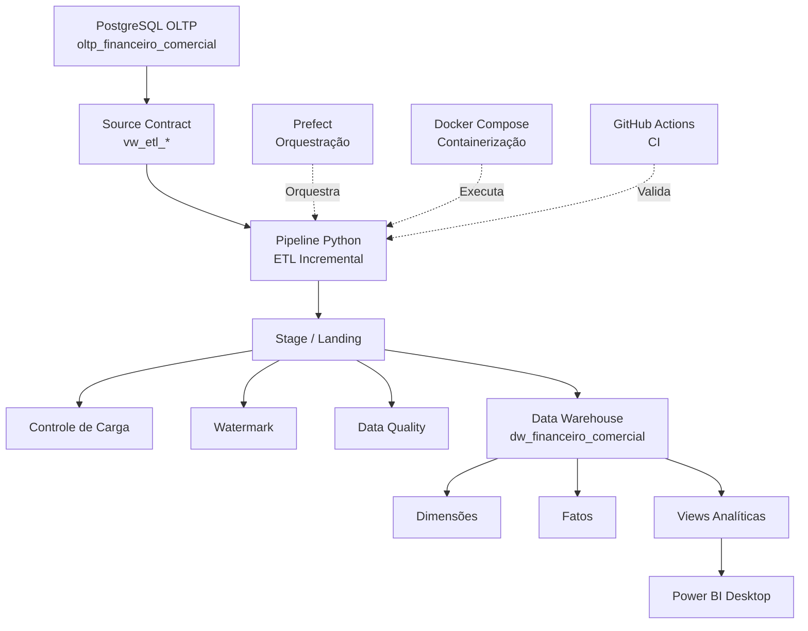
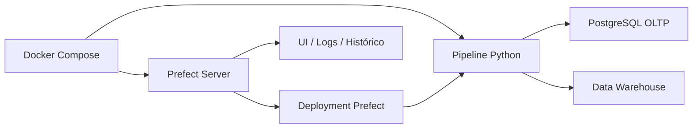
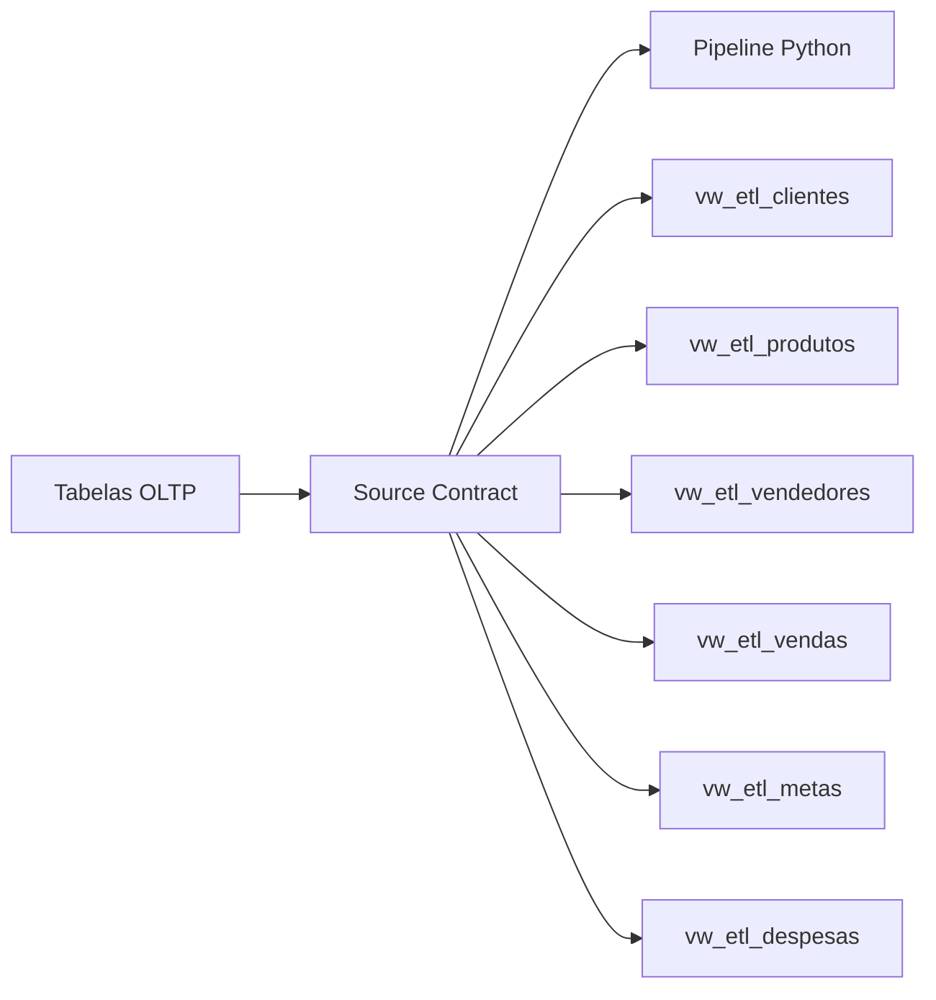
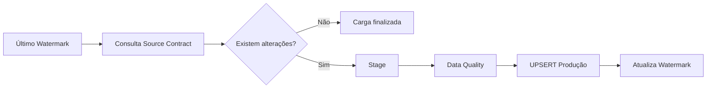
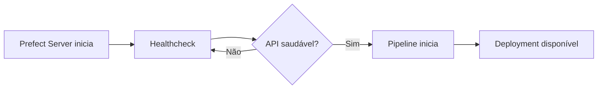
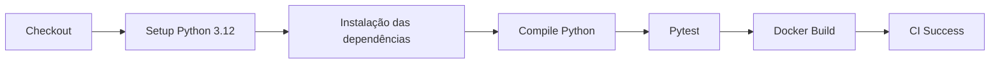
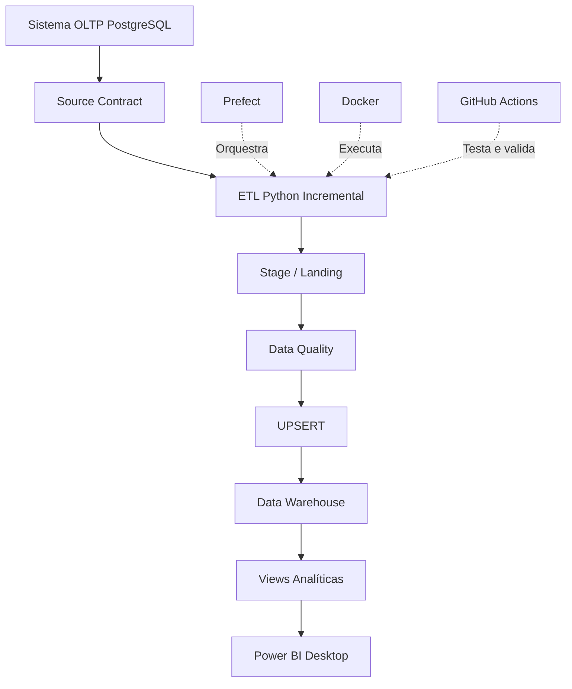

# DW Financeiro Comercial — Engenharia de Dados


Projeto de Engenharia de Dados desenvolvido para simular uma arquitetura corporativa de dados financeiros e comerciais, desde a origem transacional até a disponibilização das informações para análise no Power BI.

A solução implementa ingestão incremental, Data Warehouse dimensional, controle de watermark, auditoria, qualidade de dados, orquestração com Prefect, containerização com Docker e integração contínua com GitHub Actions.

---

## Arquitetura



### Fluxo principal

```text
PostgreSQL OLTP
        ↓
Source Contract
        ↓
Python ETL Incremental
        ↓
Stage / Landing
        ↓
Data Quality
        ↓
Data Warehouse
        ↓
Views Analíticas
        ↓
Power BI Desktop
```

### Orquestração



---

## Principais recursos

O projeto implementa:

- Pipeline ETL desenvolvido em Python.
- Extração incremental utilizando watermark.
- Processamento independente por entidade.
- Camada Source Contract através de views PostgreSQL.
- Camada Landing/Stage.
- Data Warehouse dimensional.
- Estratégia de UPSERT.
- Controle de carga.
- Auditoria de execuções.
- Validações de Data Quality.
- Logs estruturados.
- Orquestração com Prefect.
- Retries automáticos.
- Deployment Prefect.
- Execução agendada.
- Containerização com Docker.
- Docker Compose.
- Healthcheck do Prefect Server.
- Testes automatizados com Pytest.
- Integração contínua com GitHub Actions.
- Validação automática do Docker Build.
- Proteção de credenciais através de variáveis de ambiente.

---

## Tecnologias

### Engenharia de Dados

`Python` `SQL` `PostgreSQL` `SQLAlchemy` `Pandas`

### Orquestração

`Prefect`

### DevOps

`Docker` `Docker Compose` `Git` `GitHub` `GitHub Actions`

### Qualidade

`Pytest` `Data Quality` `Auditoria`

### Analytics

`Power BI`

---

## Estrutura do projeto

```text
dw-financeiro-comercial-engineering/
│
├── .github/
│   └── workflows/
│       └── ci.yml
│
├── config/
│   └── entities.yml
│
├── docs/
│   ├── architecture.md
│   ├── data_contract.md
│   ├── docker_local.md
│   └── runbook.md
│
├── orchestration/
│   └── prefect_flow.py
│
├── scripts/
│   ├── bootstrap.py
│   ├── check_connections.py
│   └── run_pipeline.py
│
├── sql/
│   ├── bootstrap/
│   ├── diagnostics/
│   ├── source_contract/
│   ├── source_demo/
│   ├── source_seed/
│   ├── transform/
│   └── transform_v2/
│
├── src/
│   └── dw_pipeline/
│       ├── __init__.py
│       ├── audit.py
│       ├── config.py
│       ├── db.py
│       ├── extract.py
│       ├── load_stage.py
│       ├── logging_config.py
│       ├── pipeline.py
│       ├── powerbi.py
│       ├── quality.py
│       └── transform.py
│
├── tests/
│   ├── test_config.py
│   └── test_quality.py
│
├── .dockerignore
├── .env.example
├── .gitignore
├── Dockerfile
├── docker-compose.yml
├── Makefile
├── requirements.txt
└── README.md
```

---

## Bancos de dados

O projeto trabalha com dois bancos PostgreSQL.

### Banco de origem

```text
oltp_financeiro_comercial
```

Representa o sistema transacional da empresa.

Principais entidades:

```text
clientes
produtos
vendedores
vendas
itens_venda
metas
despesas
```

### Data Warehouse

```text
dw_financeiro_comercial
```

Banco destinado ao consumo analítico.

Principais dimensões:

```text
dim_calendario
dim_cliente
dim_produto
dim_vendedor
```

Principais fatos:

```text
fato_vendas
fato_metas
fato_despesas
```

---

## Source Contract

O pipeline não depende diretamente da estrutura física das tabelas transacionais.

Foi criada uma camada de contrato através das seguintes views:

```text
vw_etl_clientes
vw_etl_produtos
vw_etl_vendedores
vw_etl_vendas
vw_etl_metas
vw_etl_despesas
```

Essa camada cria uma interface estável entre o sistema de origem e o processo de Engenharia de Dados.



---

## Processamento incremental

O pipeline utiliza controle de **watermark**, baseado na data de atualização dos registros.

Em cada execução são processados somente registros novos ou alterados desde a última carga bem-sucedida.

Exemplo:

```text
Carga inicial
40.000 registros processados

Nova execução sem alterações
0 registros processados

Alteração de um cliente
1 registro reprocessado
```

Isso evita processamento desnecessário e aproxima a solução de arquiteturas utilizadas em ambientes corporativos.

### Fluxo incremental



---

## Stage / Landing

A camada Stage recebe os dados antes da carga definitiva no Data Warehouse.

Entre os principais objetos estão:

```text
controle_carga
etl_watermark
dq_resultado

lnd_dim_cliente
lnd_dim_produto
lnd_dim_vendedor

lnd_fato_vendas
lnd_fato_metas
lnd_fato_despesas
```

Essa camada permite separar ingestão, validação e disponibilização dos dados.

---

## Data Quality

Antes da disponibilização dos dados em Produção, o pipeline executa verificações de qualidade.

São avaliadas situações como:

```text
Campos obrigatórios
Duplicidade de chave de negócio
Valores inválidos
Valores negativos indevidos
Integridade entre fatos e dimensões
```

Os resultados são registrados em:

```text
Stage.dq_resultado
```

O processo permite identificar problemas antes que os dados sejam disponibilizados para análise.

---

## Auditoria

Cada execução gera informações de auditoria.

Entre os dados registrados estão:

```text
ID da carga
Data de início
Data de término
Duração
Linhas processadas
Linhas inseridas
Linhas atualizadas
Linhas rejeitadas
Status
Mensagem de erro
```

Essas informações permitem rastrear o comportamento e o histórico das cargas.

---

## Orquestração com Prefect

O pipeline é orquestrado utilizando **Prefect**.

Flow:

```text
dw-financeiro-comercial
```

Deployment:

```text
dw-financeiro-comercial-producao
```

Agendamento:

```text
Todos os dias às 06:00
Timezone: America/Sao_Paulo
```

O Prefect permite acompanhar:

```text
Execuções
Status
Logs
Falhas
Retries
Histórico
Tempo de processamento
```

---

## Docker

A camada de Engenharia de Dados é executada através do Docker Compose.

Arquitetura local:

```text
Windows
│
├── PostgreSQL
│   ├── oltp_financeiro_comercial
│   └── dw_financeiro_comercial
│
└── Docker
    │
    ├── dwfc-prefect-server
    │
    └── dwfc-pipeline
```

Os containers acessam o PostgreSQL instalado no host através de:

```text
host.docker.internal
```

---

## Healthcheck

O Prefect Server possui healthcheck configurado.

O pipeline só inicia após a API do Prefect estar disponível.



Isso reduz problemas de inicialização causados por dependências ainda indisponíveis.

---

## CI — GitHub Actions

O projeto possui integração contínua executada automaticamente através do GitHub Actions.

O workflow é disparado em:

```text
push
pull_request
```

O pipeline de CI executa:



As principais etapas são:

```text
Checkout do código
Configuração do Python
Instalação das dependências
Validação de compilação
Pytest
Docker Build
```

O status atual do workflow pode ser acompanhado pelo badge no início deste README.

---

## Segurança

Credenciais reais não são armazenadas no código-fonte.

O pipeline utiliza variáveis de ambiente como:

```text
SOURCE_DB_USER
SOURCE_DB_PASSWORD

DW_DB_USER
DW_DB_PASSWORD
```

O arquivo:

```text
.env
```

é utilizado somente localmente e está incluído no `.gitignore`.

Somente o arquivo:

```text
.env.example
```

é versionado no GitHub.

Nenhuma senha, token ou segredo real deve ser adicionada ao repositório.

---

## Configuração

Clone o projeto:

```bash
git clone https://github.com/Paulobenicpv/dw-financeiro-comercial-engineering.git
```

Entre na pasta:

```bash
cd dw-financeiro-comercial-engineering
```

Crie seu arquivo `.env` com base no exemplo.

Linux/macOS:

```bash
cp .env.example .env
```

PowerShell:

```powershell
Copy-Item .env.example .env
```

Depois configure suas próprias credenciais PostgreSQL.

Exemplo:

```env
SOURCE_DB_HOST=localhost
SOURCE_DB_PORT=5432
SOURCE_DB_NAME=oltp_financeiro_comercial
SOURCE_DB_USER=seu_usuario
SOURCE_DB_PASSWORD=sua_senha

DW_DB_HOST=localhost
DW_DB_PORT=5432
DW_DB_NAME=dw_financeiro_comercial
DW_DB_USER=seu_usuario
DW_DB_PASSWORD=sua_senha

STAGE_SCHEMA=Stage
PROD_SCHEMA=Produção

ENVIRONMENT=PRODUCAO
ENTITIES_CONFIG=config/entities.yml
LOG_LEVEL=INFO

POWERBI_REFRESH_ENABLED=false
```

---

## Executando com Python

Crie o ambiente virtual:

```bash
python -m venv .venv
```

Ative o ambiente.

PowerShell:

```powershell
.\.venv\Scripts\Activate.ps1
```

Instale as dependências:

```bash
pip install -r requirements.txt
```

Configure o `PYTHONPATH`.

PowerShell:

```powershell
$env:PYTHONPATH="$PWD\src"
```

Teste as conexões:

```bash
python scripts/check_connections.py
```

---

## Executando com Docker

Construir a imagem:

```bash
docker compose build pipeline
```

Subir os serviços:

```bash
docker compose up -d
```

Verificar os containers:

```bash
docker compose ps
```

Logs do pipeline:

```bash
docker compose logs -f pipeline
```

Parar os serviços:

```bash
docker compose down
```

Interface local do Prefect:

```text
http://127.0.0.1:4200
```

---

## Executando manualmente pelo Prefect

Com o deployment ativo:

```bash
prefect deployment run "dw-financeiro-comercial/dw-financeiro-comercial-producao"
```

A execução também pode ser iniciada através da interface do Prefect.

---

## Testes

Executar os testes:

```bash
PYTHONPATH=src pytest -q
```

O GitHub Actions também executa automaticamente os testes a cada `push` e `pull_request`.

---

## Camada analítica

O Data Warehouse disponibiliza views preparadas para consumo analítico.

```text
vw_financeiro_comercial
vw_indicadores_financeiro_comercial
vw_qualidade_dados
```

Essas views são utilizadas como camada de consumo do Power BI.

---

## Power BI

O relatório foi desenvolvido no Power BI Desktop.

O projeto analítico contempla áreas como:

```text
Visão Executiva
Análise Comercial
Financeiro / DRE
Metas & Performance
Clientes & Produtos
Análise Temporal
Qualidade & Monitoramento
```

Entre os indicadores trabalhados estão:

```text
Faturamento
Receita Bruta
Lucro Bruto
Margem Bruta
Despesas
Resultado Operacional
Ticket Médio
Metas
Atingimento
Clientes Atendidos
Variação MoM
```

O arquivo `.pbix` não é versionado no GitHub.

---

## Fluxo completo da solução



---

## Objetivo do projeto

Este projeto foi desenvolvido como portfólio prático de **Engenharia de Dados e Business Intelligence**, aplicando conceitos utilizados em ambientes corporativos.

Entre os principais conceitos aplicados estão:

```text
Arquitetura de Dados
ETL Incremental
Data Warehouse
Modelagem Dimensional
Source Contract
Watermark
Data Quality
Auditoria
Observabilidade
Orquestração
Containerização
Integração Contínua
Analytics
```

---

## Status

| Componente | Status |
|---|---|
| PostgreSQL OLTP | ✅ |
| Source Contract | ✅ |
| ETL Python | ✅ |
| Carga incremental | ✅ |
| Watermark | ✅ |
| Stage / Landing | ✅ |
| Data Quality | ✅ |
| Data Warehouse | ✅ |
| Auditoria | ✅ |
| Prefect | ✅ |
| Deployment | ✅ |
| Agendamento | ✅ |
| Docker | ✅ |
| Healthcheck | ✅ |
| Pytest | ✅ |
| GitHub Actions | ✅ |
| Docker Build no CI | ✅ |
| Power BI Desktop | ✅ |

---

## Autor

**Paulo Beni**

Data & BI | Engenharia de Dados | Business Intelligence

GitHub: [@Paulobenicpv](https://github.com/Paulobenicpv)