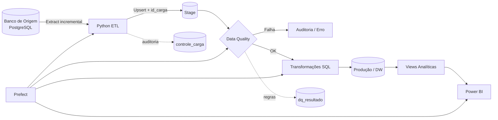

# DW Financeiro Comercial — Engenharia de Dados + BI

Projeto end-to-end de dados para um cenário financeiro/comercial, estruturado como uma solução de empresa: origem em banco de dados, ingestão incremental, staging, Data Warehouse dimensional, qualidade de dados, auditoria, orquestração com Prefect, Docker e consumo no Power BI.

## Arquitetura



## Stack

- PostgreSQL: banco de origem e Data Warehouse
- Python 3.12: ingestão, carga, auditoria e integração
- SQLAlchemy + psycopg2: conectividade e transações
- Prefect 3: orquestração, retries e agendamento
- Docker / Docker Compose: ambiente reproduzível
- Power BI: modelo semântico, DAX e visualização
- Pytest + GitHub Actions: testes e CI

## O que este projeto implementa

- Extração banco-a-banco
- Carga inicial full e depois incremental por `dt_atualizacao`
- Controle de watermark por entidade
- Upsert no Stage por chave de negócio
- Rastreabilidade com `id_carga`, `dt_carga` e `sistema_origem`
- Auditoria em `Stage.controle_carga`
- Data Quality em `Stage.dq_resultado`
- Bloqueio de Produção se regra crítica falhar
- Upsert de dimensões e fatos
- Chaves substitutas e modelo estrela
- Views de monitoramento para o Power BI
- Orquestração com retries via Prefect
- Refresh opcional do Power BI Service ao final
- Docker Compose para demo completa
- CI para compilação e testes

## Fluxo de execução

1. Prefect inicia um `pipeline_run_id`.
2. O pipeline lê o último watermark da entidade.
3. Busca no banco de origem apenas dados novos/alterados.
4. Executa validações antes da carga.
5. Faz upsert no Stage.
6. Executa regras SQL de Data Quality.
7. Se falhar, grava `ERRO` e não publica em Produção.
8. Se passar, transforma Stage → Produção.
9. Só então avança o watermark.
10. Ao final, opcionalmente solicita refresh do Power BI Service.

## Estrutura

```text
dw_financeiro_comercial_engineering/
├── config/entities.yml
├── docs/
├── orchestration/prefect_flow.py
├── powerbi/Financeiro Comercial.pbix
├── scripts/
├── sql/
│   ├── bootstrap/
│   ├── source_demo/
│   └── transform/
├── src/dw_pipeline/
├── tests/
├── .env.example
├── Dockerfile
├── docker-compose.yml
└── requirements.txt
```

## Usar com o seu banco real

O projeto foi preparado para PostgreSQL na origem e PostgreSQL no DW. Se os dois bancos estiverem no mesmo servidor, ainda assim mantenha conexões separadas por segurança e clareza arquitetural.

### 1. Ambiente Python

```bash
python -m venv .venv
# Windows
.venv\Scripts\activate
pip install -r requirements.txt
copy .env.example .env
```

### 2. Configure `.env`

```env
SOURCE_DB_HOST=localhost
SOURCE_DB_PORT=5432
SOURCE_DB_NAME=erp_financeiro_comercial
SOURCE_DB_USER=postgres
SOURCE_DB_PASSWORD=sua_senha

DW_DB_HOST=localhost
DW_DB_PORT=5432
DW_DB_NAME=dw_financeiro_comercial
DW_DB_USER=postgres
DW_DB_PASSWORD=sua_senha
```

Não envie `.env` para o GitHub.

### 3. Mapeie as tabelas da origem

Edite `config/entities.yml`. Se os nomes reais da sua origem forem diferentes de `clientes`, `produtos`, `vendedores`, `vendas`, `metas` e `despesas`, altere o mapeamento ali.

### 4. Bootstrap do DW

Os scripts são idempotentes e não usam `DROP TABLE`.

```bash
PYTHONPATH=src python scripts/bootstrap.py
```

### 5. Executar ETL

```bash
PYTHONPATH=src python scripts/run_pipeline.py
```

### 6. Executar pelo Prefect

```bash
PYTHONPATH=src python orchestration/prefect_flow.py
```

Para manter o fluxo servido e agendado, use no `.env`:

```env
PREFECT_SERVE=true
PIPELINE_CRON=0 6 * * *
PIPELINE_TIMEZONE=America/Sao_Paulo
```

## Docker — modo demonstração

O Docker Compose sobe uma arquitetura isolada com dois PostgreSQLs:

- `source-db`: banco transacional de origem
- `dw-db`: Data Warehouse
- `prefect-server`: observabilidade/orquestração
- `pipeline`: ETL

```bash
copy .env.example .env
docker compose up --build
```

No modo demo, `sql/source_demo/001_source.sql` gera dados sintéticos. Para o banco real, não use esse seed.

## Power BI

O seu PBIX atual está incluído na pasta `powerbi/`. Recomenda-se consumir apenas tabelas de Produção e views de monitoramento. `vw_qualidade_dados` e `vw_monitoramento_cargas` podem permanecer sem relacionamento com o modelo dimensional principal.

Se o relatório for publicado no Power BI Service, é possível habilitar refresh pós-pipeline com as variáveis `POWERBI_*`.

## Política operacional

- Erro de conexão: retry automático no Prefect
- Data Quality crítico: Produção não é atualizada
- Transformação falha: transação faz rollback
- Watermark só avança após sucesso
- Rerun é idempotente por upsert
- Erro de refresh do Power BI não corrompe o DW

## Como apresentar no portfólio

> Solução end-to-end de Engenharia de Dados e Business Intelligence com ingestão incremental banco-a-banco, camada Stage, Data Warehouse dimensional em PostgreSQL, auditoria de cargas, Data Quality, orquestração com Prefect, Docker, CI e Power BI.

## Atualização v2 — origem OLTP normalizada

A origem real do projeto é o banco `oltp_financeiro_comercial`, com `vendas` + `itens_venda` em modelo transacional normalizado. A camada `public.vw_etl_*` funciona como **data contract** entre o OLTP e o pipeline. Assim, alterações internas do OLTP não precisam quebrar o DW, desde que o contrato permaneça estável.

Fluxo final: `OLTP -> Source Contract Views -> Python incremental ETL -> Stage Landing -> Data Quality -> Produção/DW -> Views Analíticas -> Power BI`.
